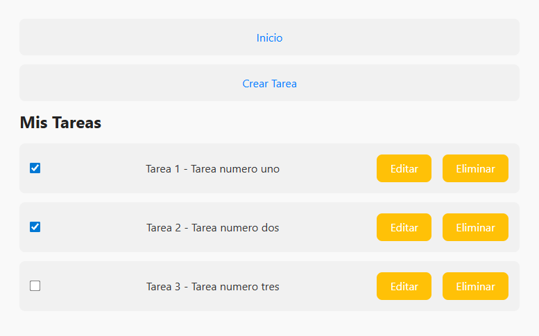
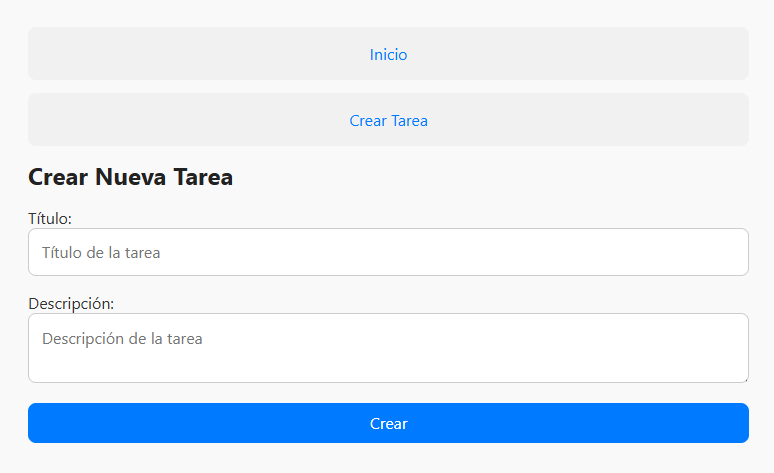

Lista de Tareas – Full Stack App (Para ForIt)
Aplicación básica de lista de tareas desarrollada con:

🖥️ Frontend: React

🌐 Backend: Node.js + Express

📦 Dependencia útil: concurrently para ejecutar ambos servidores en simultáneo.

¿Cómo iniciar el proyecto?

1. Cloná el repositorio
git clone https://github.com/pedromax23/Lista-de-tareas
cd '.\Lista de tareas\'

2. Instalá las dependencias

Para el Backend
- cd BackEnd
- npm install

Para el Frontend
- cd ../FrontEnd
- npm install

3. Volvé a la raíz del proyecto

- cd ..

Asegurate de tener este archivo "package.json" en la raíz, con el siguiente script:
"scripts": {
  "dev": "concurrently \"npm run server --prefix BackEnd\" \"npm start --prefix FrontEnd\""
}

4. Ejecutá ambos proyectos a la vez
Desde la raíz:
- npm run dev

Esto va a:

Iniciar el backend en http://localhost:5173/ (o el puerto que uses).

Iniciar el frontend en http://localhost:4000.

📬 API Endpoints (ejemplo)
GET /tareas – Obtener todas las tareas.

POST /tareas – Crear una nueva tarea.

PUT /tareas/:id – Editar una tarea.

DELETE /tareas/:id – Eliminar tarea.

HOME

CREAR TAREA
